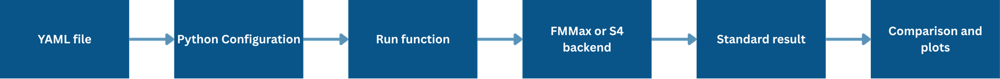

# Photonic Benchmarks

## Project Goal

The goal of the internship is to develop a python based benchmarking framework for comparing RCWA electromagnetic solvers.

A user will be able to define a periodic layered photonic structure and its simulation settings in a YAML file, Python then loads it into a structured configuration object and the appropriate backend translates the configuration into FMMax or S4 commands. 

S4 and FMMax will return results in a standardised format so that their outputs can be compared without writing seperate comparison logic for every structure. 

The framework will initially be demonstrated using a 1D metal grating/2D square particle. 

The project will also have reusable functions for convergence, and nondispersive wavelength studies and etc. 

The main framework will be completed by the end of August. The remaining time in September will be reserved for debugging, numerical investigation, documentation and any required report.

## Project Layout

Photonic bench:
- `configs/`: Stores values for each benchmark
    - `metal_grating.yaml`
    - `square_particle.yaml`
- `model/` : Defines how the physical problem and numerical settings and results are represented in Python e.g.: 
    - `config.py`
        - Defines the top-level benchmark configuration
        - Uses MetaRCWA's existing model classes and numerical configuration
        - Stores the additional solver-specific settings required by S4 and FMMax
        - Loads configuration information from YAML
    - `result.py`
        - Defines the standard result format returned by FMMax and S4
- `backends/`: Translates the common MetaRCWA model into solver-ready commands.
    - `s4_backend.py`
        - Creates the S4 simulation
        - Creates the S4 materials, lattices, layers and patterns
        - Applies the supported S4 numerical settings
        - Runs the simulation
        - Extracts and returns the requested results
    - `fmmax_backend.py`  
        - Creates the FMMax lattice and geometry representations
        - Generates the Fourier expansion
        - Solves the layers and constructs the scattering matrix
        - Extract and returns the requested results
- `studies/`: While the backend performs one simulation, a study can perform several simulations in a controlled series. 
    - `convergence.py`
        - Changes basis while physical problem is fixed
    - `wavelength_sweep.py`
        - Changes wavelength while holding everything else fixed. Initial wavelength studies will be nondispersive where material permittivies are held constant.
- `validation/`: To check whether the results returned appear reliable
    - `failures.py`
        - Checks for failed simulations, NaNs, infinite values
    - `discrepancy.py`
        - Compares corresponding FMMax and S4 results
- `reports/`: Turns results into readable figures and summaries
    - `plots.py`
        - TE convergence plots, TM convergence plots, wavelength plots, runtime plots and etc
- `results/`: Contains generated CSV files, plots and other output data
- `docs/`: Usage instructions and documents any issues found 
- `run_benchmark.py`: Terminal facing script that loads the YAML, creates the benchmark configuration, runs selected solver and prints or save results

## Week 1 26/07/2026 - 30/07/2026

### Goal: Use MetaRCWA's existing physical model and configuration to run a square particle simulation through S4 and FMMax

 Set Tasks: 

- Understand the relevant MetaRCWA model class which includes `Lattice`, `Layer`,`Medium`, `Stack`, `Source`, `Config`.
- Define a benchmark configuration that combines a physical model constructed using MetaRCWA with the numerical settings required to run that model in S4 and FMMax
- Create a square particle YAML configuration
- Implement the backend that will translate to S4 ready
- Implement a function, say `run_s4()` to run a simulation
- Repeat for FMMax
- Define a minimal standard result format
- Check both backends return the same result

### Completed:

- Created a new branch called `restructure-framework` with a folder called `photonic_bench` containing: 
    - initial square-particle YAML configuration
    - initial standard result format
    - initial FMMax and S4 backend scaffolds
    - initial `run_benchmark.py` to run commands from terminal
    - initial dictionary conversion methods for configuration data
    - MetaRCWA square particle model
- Reviewed the example architecture provided by mentor.
- Created the `restructure-framework-2` branch to implement the revised design while preserving the first prototype.
- Reviewed the relevant MetaRCWA classes: `Medium`, `Lattice`, `Layer`, `Stack`, `Source`, `Model`, solver `Config`
- Implemented a minimal common numerical `Config` containing:
    - numerical precision
    - device
    - grid resolution
    - Fourier harmonic limits
    - truncation rule
    - `to_dict()` and `from_dict()` for common config
- Implemented a MetaRCWA config adapter
- Added a test confirming MetaRCWA simulation route returns finite results
- Resolved and inspected the `ModelSpec` to see what it returned and how it was represented
- Implemented an initial FMMax config adapter
- Implemented PyTorch to jax array conversion
- Translated lattice vectors into FMMax format
- Generated first FMMax Fourier Expansion
- Added tests

## Week 2 02/08/2026 - 06/08/2026

### Goal: Complete the FMMax and S4 routes and beging shared studies

### Tasks:

- Complete FMMax layer translation and simulation
- Implement the S4 config adapter and simulation
- Adapt the previous square-particle YAML to the revised framework and implement YAML loading
- Define standard result format for all solvers and make them return it
- terminal facing benchmark runner with the revised framework
- Implement the convergence study
- Implement the nondispersive wavelength study
- TE/s and TM/p comparison 
- Runtime collection
- Save study results in a common CSV format
- Save configuration and solver-version data with result
- Add a YAML-loading test or some other basic configuration/backend test 

## Week 3 09/08/2026 - 13/08/2026

### Goal: Add another geometry

### Tasks:
- YAML to S4 and FMMax results pipelines repeated for a new geometry
- Conduct the studies for the new geometry

## Week 4: 16/08/2026 - 20/08/2026

### Goal: Numerical Validation 

### Tasks:
- Add failure/non-finite value reporting
- Add solver-discrepancy calculations to compare FMMax and S4 results
- Record the requested and actual basis information used by each solver
- Investigate the previously observed TE offset
- Investigate the previously observed TM fluctuations
- Record the numerical options enbled by each backend and perform targeted, one at a time tests of the formulation, factorisation, smoothing, and precision settings in order to explain any TM vs TE or FMMax vs S4 discrepancies 

## Week 5: 23/08/2026 - 27/08/2026

### Goal: Producable a useable framework

### Tasks: 
- Clean API and package layout 
- Document installation and example commands
- Add a YAML reference explaining each supported field, its meaning, units, accepted values and an example.
- Record any issues found
- Basic configuration and backend tests to confirm that the essential parts of this benchmarking framework work where you have a small set of tests confirming that the YAML files load correctly, that any bad settings produce a clear error early on instead of causing failure later e.g. flagging a negative basis, and etc. 
- Plan for September (Will have 3 weeks and 2 days after the end of Week 5)
