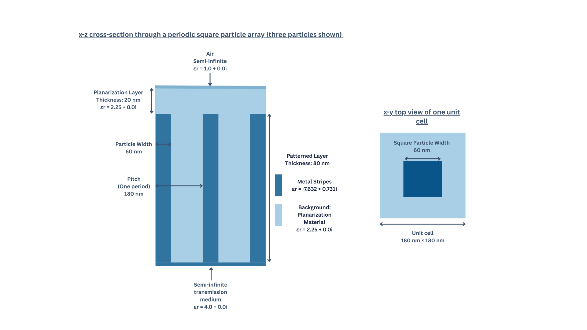
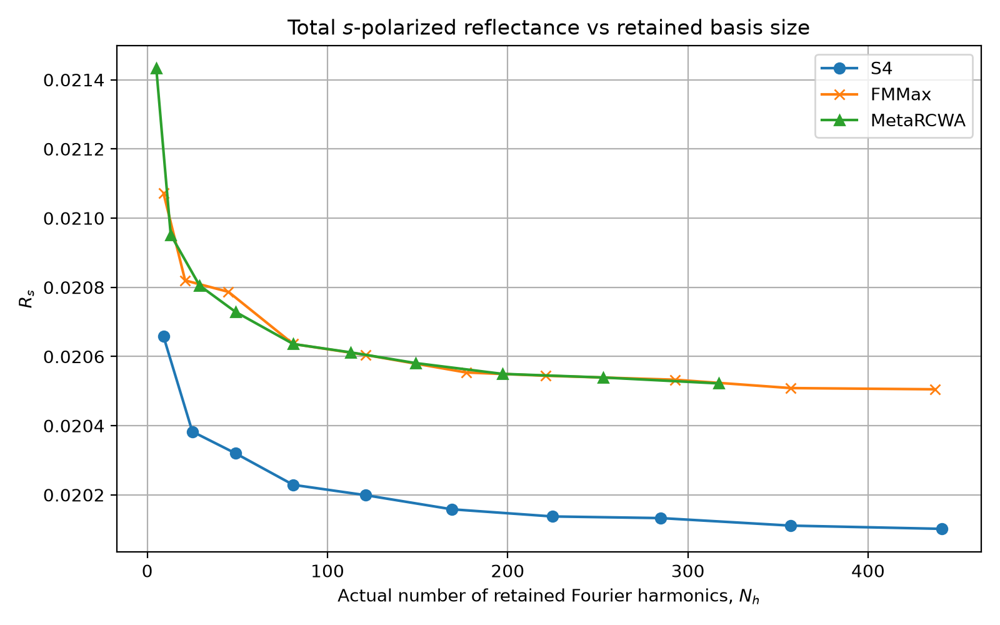

# Photonic Benchmarks

A Python research framework under development for comparing rigorous
coupled-wave analysis (RCWA) solvers using a shared physical model and
numerical configuration.

Supported backends:

- [FMMax](https://github.com/facebookresearch/fmmax)
- [S4](https://web.stanford.edu/group/fan/S4/)
- [MetaRCWA](https://github.com/RodionovSA/metarcwa)

The working example is a Fourier-order convergence study for a periodic square
particle. Each adapter returns total reflectance and transmittance for separate
s- and p-polarized incident plane waves.

## Repository Layout

- [src](src)
  - [benchmark.py](src/benchmark.py)
    - Runs all three backends
  - [config.py](src/config.py)
    - Shared numerical configuration
  - [config.yaml](src/config.yaml)
    - Numerical settings for the examples
  - [fmmax](src/fmmax)
    - Contains FMMax configuration and simulation adapters
  - [s4](src/s4)
    - S4 configuration, geometry and simulation adapters
  - [metarcwa](src/metarcwa)
    - MetaRCWA configuration and simulation adapters
- [examples](examples)
  - [model_square.py](examples/model_square.py)
    - Example physical model which is constructed in Python using MetaRCWA model objects.
- [studies](studies)
  - [square_convergence.py](studies/square_convergence.py)
- [outputs](outputs)
  - Saved reference CSVs and plots
- [archive](archive)
  - Earlier implementations, notebooks and tests


## Setup

Developed using Python 3.12. Install the locked Python dependencies with
```bash
uv sync --locked
```

S4 requires separate [installation](https://web.stanford.edu/group/fan/S4/install.html). It is not installed by `uv sync`. The development
environment used a custom Python 3.12 S4 extension.

## Run

From the repository root:

```bash
uv run python -m studies.square_convergence
```

- Physical model: `examples/model_square.py`
- Numerical settings: `src/config.yaml`
- Study: `studies/square_convergence.py`

The study overrides YAML `m` and `n`, sweeping `m=n` from 1 through 10.
For a quicker check, shorten that list in the study script.

Results are saved after the sweep finishes:

```text
outputs/square/square_convergence.csv
outputs/square/square_convergence.png
```

Existing files with those names are overwritten.

## Current Example and Results

The reference model is a periodic array of square particles embedded in a layered dielectric structure.



**Figure 1:** Geometry of the periodic square-particle benchmark. The structure repeats every 180 nm along both in-plane directions. A 20 nm homogeneous layer precedes an 80 nm patterned layer containing a centred
60 nm × 60 nm square particle.

The model in [`examples/model_square.py`](examples/model_square.py) contains:

| Property | Value |
|---|---|
| Square lattice period | 180 nm in both directions |
| Particle width and height | 60 nm × 60 nm |
| Homogeneous planarization layer thickness | 20 nm |
| Patterned layer thickness | 80 nm |
| Incidence-medium permittivity | 1 |
| Planarization and patterned-background permittivity | 2.25 |
| Particle and transmission-medium permittivity | 4 |
| Wavelength | 500 nm |
| Incidence angles | θ = 0 rad, φ = 0 rad |

All materials are lossless and nondispersive. The incidence and
transmission media are semi-infinite.



**Figure 2:** Total s-polarized reflectance at a free-space wavelength of 500 nm and normal incidence, plotted against each solver's actual retained Fourier-order count. FMMax and MetaRCWA use a fixed 96 × 96 spatial grid; S4 represents the rectangle analytically. The saved [CSV](outputs/square/square_convergence.csv) shows similar FMMax and MetaRCWA reflectance values, with S4 systematically lower over the tested range.

## Project Status

This project is a work in progress. The square-particle benchmark is the currently tested workflow; support for additional models, reusable studies and further numerical validation is under development.