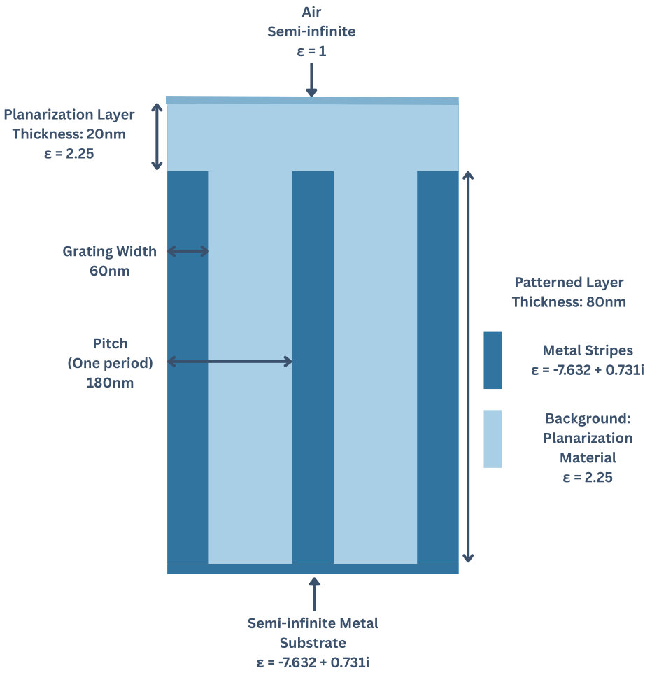

# Metal Grating Documentation

## What this Section Covers:

This script reproduces the FMMax metal grating benchmark using the Stanford Stratified Structure Solver ($S^4$).

The objective is to compare convergence behaviour, accuracy and computational performance of $S^4$ and FMMax for the same physical 1D grating. 

The implementation follows the physical structure used by FMMax while adapting it to S4 API and S4's one dimensional RCWA formulation. 

## Overall Program Structure


**Figure 1:** The script first has command line configuration options where you can modify the formulation or Fourier basis sizes without changing the code, defines physical parameters and helper functions, constructs an S4 simulation, solves the electromagnetic problem while extracting the reflection coefficients and runtime, performs the convergence study over the specified Fourier basis sizes and formulation and outputs the benchmark results as CSV data for subsequent analysis and plotting.

## Physical Structure



**Figure 2:** Schematic of the metal grating benchmark geometry from FMMax reproduced in S4. The structure consists of a semi-infinite air superstrate, a 20nm planarization layer and an 80nm thick patterned layer containing 60nm wide metal stripes embedded in the planarization material, and a semi-infinite metal substrate. The grating period is 180nm. *Diagram not to scale*

### Z-Coordinate

In S4, the $z$-coordinate increases from the semi-infinite
ambient toward the substrate. Because the first and last layers have zero
specified thickness, they represent semi-infinite exterior regions.

For this structure, $z=0$ is the ambient-planarization interface. The
layer positions are therefore

$$
\begin{aligned}
\text{Ambient:} &\quad z<0,\\
\text{Planarization:} &\quad 0<z<20\ \mathrm{nm},\\
\text{Grating:} &\quad 20<z<100\ \mathrm{nm},\\
\text{Substrate:} &\quad z>100\ \mathrm{nm}.
\end{aligned}
$$

Thus, positive $z$ points from the ambient side toward the substrate,
while the ambient itself extends toward negative infinity.

## Simulation Parameters

|Parameter|Value|
|--------|----|
|Pitch|180nm|
|Grating Width|60nm|
|Grating Thickness|80nm|
|Planarization Thickness|20nm|
|Wavelength|500nm|
|$\varepsilon_{\mathrm{ambient}}$|1.0+0.0i|
|$\varepsilon_{\mathrm{planarization}}$|2.25+0.0i|
|$\varepsilon_{\mathrm{substrate}}$|-7.632+0.731i|

## Program Sections

### 1. Command Line Configurations

This first section allows parameters to be supplied from the terminal. 

```lua
pcall(loadstring(S4.arg))
form = form or 'fft'
```

Instead of modifying the source code everytime a different formulation or Fourier basis size is required, variables can be passed directly on the command line such as:

```lua
S4 -a 'NG=9; form="fft"' metal_grating.lua
```

`S4.arg` is the string containing the text that is supplied through S4's `-a` command-line option.  So in the example above, `S4.arg` is `'NG=9; form="fft"'` `loadstring(S4.arg)` then converts that text into executable Lua code. `pcall(...)` means protected call and it runs the function returned by `loadstring()` and doesn't terminate the script if it fails. This way if the argument is invalid or there is no -a argument provided, the entire script doesn't immediately crash. 


If no formulation is supplied, the FFT formulation is selected as the default. 

### 2. Physical Parameters

The next section defines the physical dimensions of the benchmark. 

### 3. Material Definitions

S4 represents complex permittivity using two-element Lua tables. 

```lua
local substrate_permittivity = {-7.632, 0.731}
```

means $\varepsilon_{\mathrm{substrate}}$=-7.632+0.731. Lua doesn't have a built in complex number datatype like Python so this is the representation you will see in S4.

### 4. Basis Sweep

```lua
local basis_sweep = {
	{fmmax_equivalent_terms = 9,   s4_num_g = 3},
	{fmmax_equivalent_terms = 25,  s4_num_g = 5},
	{fmmax_equivalent_terms = 49,  s4_num_g = 7},
	{fmmax_equivalent_terms = 81,  s4_num_g = 9},
	{fmmax_equivalent_terms = 121, s4_num_g = 11},
	{fmmax_equivalent_terms = 169, s4_num_g = 13},
	{fmmax_equivalent_terms = 225, s4_num_g = 15},
	{fmmax_equivalent_terms = 289, s4_num_g = 17},
	{fmmax_equivalent_terms = 361, s4_num_g = 19},
	{fmmax_equivalent_terms = 441, s4_num_g = 21},
	{fmmax_equivalent_terms = 529, s4_num_g = 23},
	{fmmax_equivalent_terms = 625, s4_num_g = 25},
	{fmmax_equivalent_terms = 729, s4_num_g = 27},
	{fmmax_equivalent_terms = 841, s4_num_g = 29}
}
```

This benchmark looks at convergence with increasing Fourier basis size. This table defines every basis size to be tested. Each entry stores the equivalent basis used in FMMax and the corresponding S4 values. The convergence study simply loops over this table if you don't provide a NG value which would just test one basis size of NG. 

This was done to make it easy to add new basis sizes, remove basis sizes and also compare directly with FMMax. 

### 5. Complex-Number Helper Functions

Lua does not provide a built-in complex number type, so two helper functions are used to perform complex division and calculate a complex magnitude squared. 

### 6. Building a Simulation

`create_metal_grating_simulation()` constructs a complete S4 simulation. This function doesn't solve Maxwell's equations, it simply constructs the object being simulated. 

It performs:
- Creating an empty simulation 
- Defining the lattice
- Fourier basis selection
- Creating the materials used
- Creating the layers 
- Applying grating patterns
- Plane-wave excitation: specifies the direction, polarisation and phase of the incoming plane wave that illuminates the grating
- Formulation selection

### 7. Solving One Simulation

```lua
-- Solve one simulation and extract the complex reflection coefficient for the 0th order reflected wave
local function solve_and_extract_reflection(requested_num_g, polarization)
	local simulation = create_metal_grating_simulation(requested_num_g, polarization)

	local start_cpu_time = os.clock()

	-- Get the forward incident amplitude and backward reflected amplitude
	-- in the uniform ambient layer. Requesting these amplitudes causes S4 to
	-- solve the complete layer stack
	local forward_amplitudes, backward_amplitudes = simulation:GetAmplitudes('Ambient', 0)

	local cpu_seconds = os.clock() - start_cpu_time

	-- SetNumG gives an upper bound; GetNumG returns the actual number of harmonics
	-- used in the simulation.
	local actual_num_g = simulation:GetNumG()

	-- Returns the 1-based Lua index of the (0,0) diffraction order.
	local zero_order = simulation:GetDiffractionOrder(0, 0)

	local amplitude_index = zero_order

	if polarization == 'p' then
		amplitude_index = zero_order + actual_num_g
	end

	local incident_amplitude = forward_amplitudes[amplitude_index]
	local reflected_amplitude = backward_amplitudes[amplitude_index]

	-- Compute the complex reflection coefficient:
	-- ratio of reflected to incident amplitude
	local reflection_coefficient = divide_complex(reflected_amplitude, incident_amplitude)

	return reflection_coefficient, actual_num_g, cpu_seconds

end
```

#### <u> Purpose:</u>

This function performs

$$
r_{00} =
\frac{A_{00}^{\mathrm{backward}}}
     {A_{00}^{\mathrm{forward}}}
$$

which is the complex specular reflection coefficient for one incident polarisation and one Fourier basis size where ${A_{00}^{\mathrm{backward}}}$ is the reflected modal coefficient and ${A_{00}^{\mathrm{forward}}}$ is the incident modal coefficient. 

The function:
1. Constructs the physical structure
2. Configures the source and numerical formulation
3. Asks S4 to solve the complete multilayer scattering problem 
4. Extracts the incident and reflected zero-order modal coefficients
5. Calculates the complex modal reflection coefficient
6. Records the CPU time used by the solve


#### <u> Build the simulation object:</u>
```lua
local simulation = create_metal_grating_simulation(requested_num_g, polarization)
```

Creates and configures a new S4 simulation with:
- The 1D lattice and grating period
- The material permittivities
- The layer geometry and thickness
- The incident polarisation
- The wavelength
- The requested Fourier basis sizes
- The selected S4 formulation

#### <u> Locating the Zeroth Diffraction Order: </u>
```lua
-- Returns the 1-based Lua index of the (0,0) diffraction order.
local zero_order = simulation:GetDiffractionOrder(0, 0)
```

A periodic grating can scatter an incident wave into several diffraction orders. In general 2D periodic structure these order are labelled by two integers. 

$$
(m,n)
$$

The integers specify the reciprocal-lattice momentum added in the two periodic directions. 

For this 1D grating, the structure is periodic along only x and uniform along y. So, the relevant diffraction orders are:

$$
(m,0),
\qquad
m = 0,\pm 1,\pm 2,\ldots
$$

The $(0,0)$ order has no additional in-plane momentum from the grating. In the ambient layer, its backward-propagating component is the specular, or mirror-like reflected wave. 

We don't know how S4 orders its lists so in order to search S4's order list and return the position of the (0,0) order we use `GetDiffractionOrder(0,0)`. 

Lua uses one-based indexing so the first array entry has index 1. And therefore `GetDiffractionOrder(0,0)` returns an index that can be used directly with the Lua amplitude tables. This index identifies the diffraction order within one `NumG` block. We have to later select the appropriate polarisation block. 

#### <u>Timing:</u>
```lua
local start_cpu_time = os.clock()
```
Records the CPU time immediately before `GetAmplitudes()` is called. The elapsed time is later calculated using: 

```lua
local cpu_seconds = os.clock() - start_cpu_time
```

`os.clock()` starts immediately before `GetAmplitudes()` and stops immediately afterward. It measures the CPU time consumed by the solve triggered by `GetAmplitudes()`. It excludes simulation construction and the subsequent calls to `GetNumG()` and `GetDiffractionOrder()`.

At this time of writing, we should not yet treat it as directly equivalent to FMMax's `time.perf_counter()` measurement. 

#### <u>Forward and Backward Amplitudes:</u>

```lua
-- Get the forward incident amplitude and backward reflected amplitude
-- in the uniform ambient layer. Requesting these amplitudes causes S4 to
-- solve the complete layer stack
local forward_amplitudes, backward_amplitudes = simulation:GetAmplitudes('Ambient', 0)
```

This tells S4 to solve the electromagnetic scattering problem for the complete layer stack: Ambient, Planarisation, Patterned grating, Substrate. 

The argument "Ambient" doesn't tell S4 to only solve the ambient layer. It specifies the layer in which you want the resulting modal coefficient to be returned.

Because the ambient is a uniform layer, its modes can be interpreted as diffraction orders. 

S4 represents the electromagnetic field as a sum of modes. In a uniform layer, each mode is identified by:
- a diffraction order
- one of two independent polarisation components
- a forward or backward propagating direction

A modal coefficient is the complex weight multiplying one of these modes. It contains information about both the magnitude and phase of that mode. It is not a direct electric or magnetic field value at a single point. 

For a diffraction orderwith wavevector

$$
\mathbf{k}=(k_x,k_y,k_z),
$$

the magnetic field must satisfy

$$
\mathbf{k}\cdot\mathbf{H}=0.
$$

Expanding the dot product gives: 

$$
k_xH_x+k_yH_y+k_zH_z=0.
$$

Solving for $H_z$ gives:

$$
H_z=-\frac{k_xH_x+k_yH_y}{k_z}.
$$

This means that once $H_x$ and $H_y$ are known, $H_z$ is determined automatically. So, the magnetic field has only two independent components.

S4 represents these two independent components using the modal coefficients $a$ and $b$:

$$
a=H_x,
\qquad
b=H_y.
$$

Substituting these definitions into the expression for $H_z$ gives:

$$
H_z=-\frac{k_xa+k_yb}{k_z}.
$$

The complete magnetic-field vector can therefore be written as:

$$
\mathbf{H}=\left(a,\,b,\,-\frac{k_xa+k_yb}{k_z}\right).
$$

This can be separated into two basis-vector contributions:

$$
\mathbf{H}
=
a\left(1,0,-\frac{k_x}{k_z}\right)
+
b\left(0,1,-\frac{k_y}{k_z}\right).
$$

S4 describes the magnetic-field contribution of that order using two complex coefficients, $a$ and $b$:

$$
\mathbf{H}
=
a\left(1,0,-\frac{k_x}{k_z}\right)
+
b\left(0,1,-\frac{k_y}{k_z}\right).
$$

The first `NumG` entries of each amplitude table contain the $a$, or $H_x$-like, coefficients. The second `NumG` entries contain the $b$, or $H_y$-like, coefficients.

At normal incidence,

$$
k_x=k_y=0
$$

so the magnetic field expansion simplifies to 

$$
\mathbf{H}
=
a(1,0,0)+b(0,1,0).
$$

Which means in our special case, $a$ corresponds to $H_x$ and $b$ corresponds to $H_y$. 


For this isotropic 1D grating at normal incidence: 

For a plane wave in an isotropic medium, the electric field $\mathbf{E}$, magnetic field $\mathbf{H}$ and propagation direction $\mathbf{k}$ are mutually perpendicular. 

Their relationship is

$$
\mathbf{H} = \frac{1}{Z}\hat{\mathbf{k}}\times\mathbf{E}
$$

where:
- $\hat{\mathbf{k}}$ is a unit vector in the propagation direction
- $Z$ is the wave impedance of the medium

The factor $1/Z$ determines the physical amplitude of the magnetic field but doesn't change its direction.

For normal incidence in this S4 simulation, the wave travels along the
positive $z$ direction:

$$
\hat{\mathbf{k}}=\hat{\mathbf{z}}.
$$

The cyclic cross-product relationships between the Cartesian unit vectors
are

$$
\hat{\mathbf{x}}\times\hat{\mathbf{y}}=\hat{\mathbf{z}},
$$

$$
\hat{\mathbf{y}}\times\hat{\mathbf{z}}=\hat{\mathbf{x}},
$$

and

$$
\hat{\mathbf{z}}\times\hat{\mathbf{x}}=\hat{\mathbf{y}}.
$$

Reversing the order of a cross product changes its sign. Therefore,

$$
\hat{\mathbf{z}}\times\hat{\mathbf{y}}
=
-\hat{\mathbf{x}}.
$$

#### s/TE Polarization

At normal incidence, the electric field of the s-polarized wave points
along the $y$ direction:

$$
\mathbf{E}_s\parallel\hat{\mathbf{y}}.
$$

The corresponding magnetic-field direction is

$$
\mathbf{H}_s
\propto
\hat{\mathbf{k}}\times\mathbf{E}_s
=
\hat{\mathbf{z}}\times\hat{\mathbf{y}}
=
-\hat{\mathbf{x}}.
$$

Therefore, s/TE excitation produces an $H_x$-like coefficient, including
a minus sign from the field-direction convention:

$$
s/\mathrm{TE}
\quad\longrightarrow\quad
E_y
\quad\longrightarrow\quad
-H_x.
$$

S4 stores the $H_x$-like coefficients in the first `NumG` entries of
each amplitude table.

#### p/TM Polarization

At normal incidence, the electric field of the p-polarized wave points
along the $x$ direction:

$$
\mathbf{E}_p\parallel\hat{\mathbf{x}}.
$$

The corresponding magnetic-field direction is

$$
\mathbf{H}_p
\propto
\hat{\mathbf{k}}\times\mathbf{E}_p
=
\hat{\mathbf{z}}\times\hat{\mathbf{x}}
=
\hat{\mathbf{y}}.
$$

Therefore,

$$
p/\mathrm{TM}
\quad\longrightarrow\quad
E_x
\quad\longrightarrow\quad
H_y.
$$

S4 stores the $H_y$-like coefficients in the second `NumG` entries of
each amplitude table.

The resulting mapping is:

| Incident polarization | Electric-field direction | Magnetic-field direction | S4 amplitude block |
|---|---|---|---|
| s / TE | $E_y$ | $-H_x$ | First `NumG` entries |
| p / TM | $E_x$ | $H_y$ | Second `NumG` entries |

Therefore, the relevant array index is selected using

```lua
local amplitude_index = zero_order

if polarization == "p" then
    amplitude_index = zero_order + actual_num_g
end
```


The returned values are: 

- `forward_amplitudes`: coefficients of modes travelling from the ambient toward the structure
- `backward_amplitudes`: coefficients of modes travelling away from the structure and back into the ambient

For this simulation:
- the forward zeroth-order coefficient is the imposed incident wave
- the backward zeroth-order coefficient is the specular reflected wave
- higher-order backward coefficients describe higher reflected diffraction orders, including evanescent orders.

Each table contains 2 * NumG complex modal coefficient because every retained diffraction order has two independent transverse polarisation components.

For the zero-thickness ambient layer, an offset of 0 corresponds to the ambient–planarization interface and provides a consistent phase-reference plane for the reflection coefficients. 